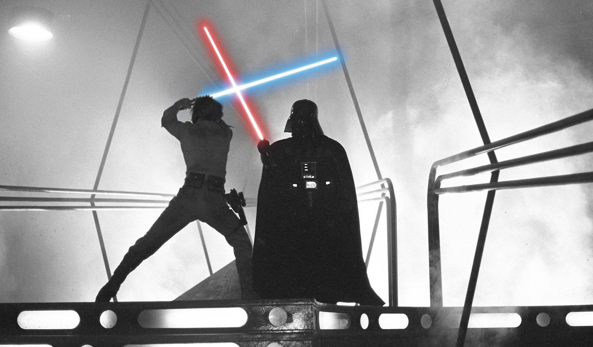
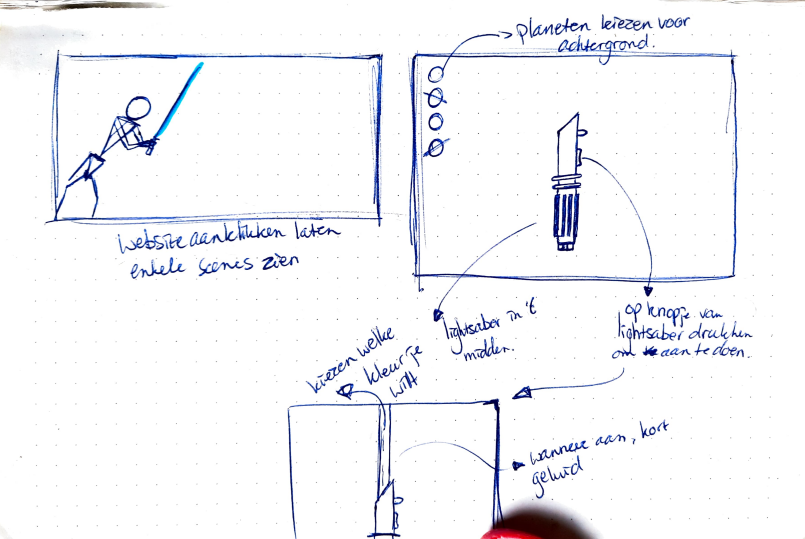
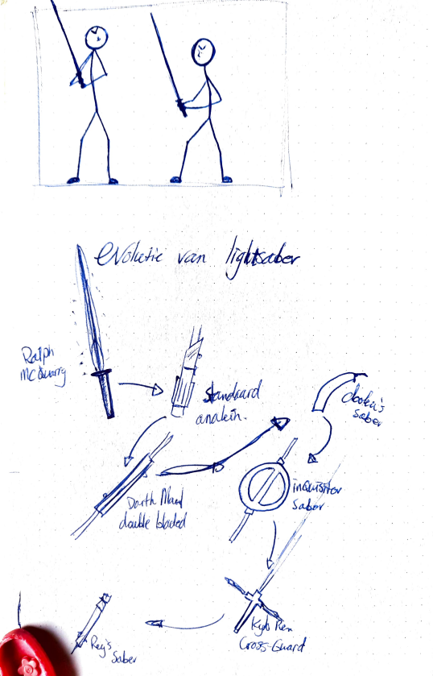
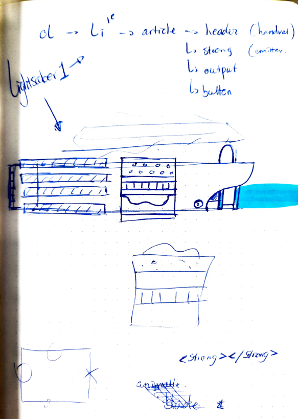
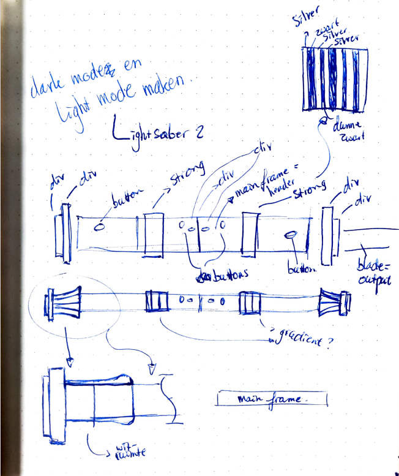
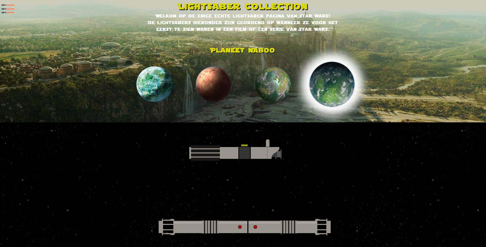
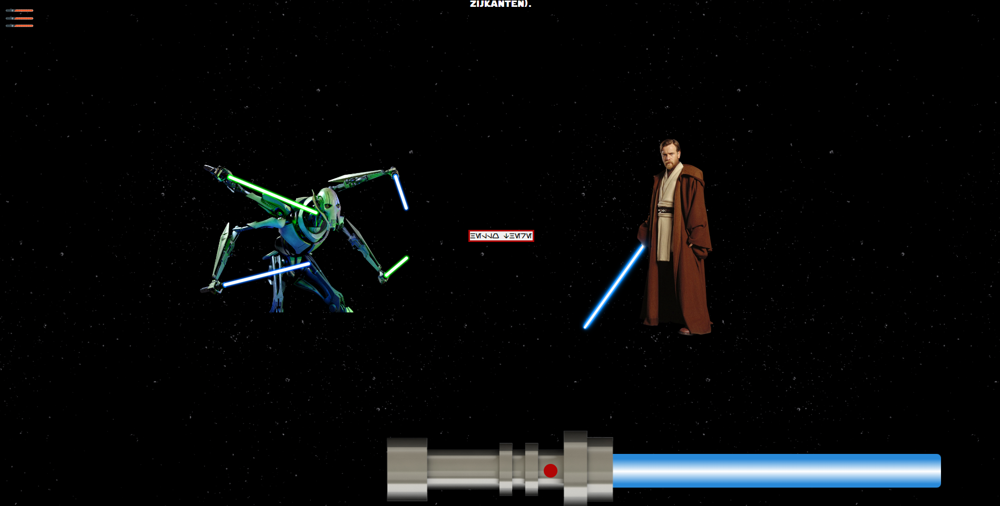

# Procesverslag voor de tijdlijn website

## Ontwerper

Jasper Riepe

## Je startniveau

Blauw

# Mijn progressie

Afbeelding van een eerste schets voor mijn website

  
De eerste versie/schets van je ontwerp & je persoonlijke uitdaging

## Een paar van de vele schetsen die ik maakte voor de website

### Je ambitie

- Ik wil werken aan het beter begrijpen en gebruiken van HTML en CSS
- Ik vind het belangrijk om een beter inzicht te krijgen in hoe de verschillende CSS elementen gebruikt kunnen worden om tot een gewenst resultaat te komen.
- Ik wil mijn kennis over het gebruik van code verbeteren om dit later te kunnen toepassen op eigen projecten.

## Voortgang/Feedback 1

  
Samenvatting van de eerste feedback (1 nov. 2022)

### Bevindingen

- Kijk goed waar je je informatie gaat neerzetten en maak deze ook informatief.
- Hele scherm benutten, leuk om naar links en rechts te scrollen of naar beneden.
- Interactief lightsaber wanneer je scrollt, dat hij langer wordt.
- Sounds toevoegen aan de lightsabers.
- Misschien filmpjes van gevecht scenes toevoegen.
- Soort opstart animatie toevoegen.
- LEGO Star Wars lightsaber toevoegen.
- Achtergrond zwart met wat fonkelende sterretjes

### Oplossingen

Tijdens de feedback van een andere student, heb ik veel nieuwe en goeie ideeën gekregen. Zo moet ik goed gaan nadenken waar ik mijn informatie neerzet. Dit wil ik graag interactief houden, dus de plek is belangrijk. Daarnaast moet ik een besluit nemen hoe ik de hele pagina wil gaan vullen. Naar beneden scrollen of links en rechts? Er moet ook duidelijke feedback komen voor de gebruiker als hij/zij op een bepaalde knop drukt. Dit kan visueel gebeuren door een zichtbare verandering of op een andere manier.

Als volgt is het toevoegen van geluiden een _must have_. Lightsabers hebben een enorm uniek geluid, een die elk persoon wel kan herkennen. Deze wil ik dus enorm graag toepassen. Dit geldt ook voor quotes van karakters uit de film of series of andere speciale geluiden. Ik ga dus de aankomende week meer focus leggen op het begrijpen van Java codes. Ik heb het gevoel dat hier de sleutel ligt tot het maken van vele animaties.

Ik zit ook al na te denken over een opstart animatie. Dus als je de website aanklikt en voor het eerst bekijkt, dat er een aantal afbeeldingen van lightsaber vecht scènes in beeld komen, dan langzaam het woord **Star Wars** en vervolgens verdwijnt het allemaal en verschijnen de lightabers. Door lightsabers te laten zien vooraf, weet de gebruiker sneller dat het over lightsabers gaat. Ik heb nog geen idee hoe ik dit moet gaan aanpakken, maar zoals ik al zei moet dit met CSS en Java wel lukken.

Een Easter Egg kan een LEGO lightsabers zijn die ik toevoeg. Deze wordt natuurlijk niet in de films of dergelijke gebruikt, maar is wel een iconisch LEGO onderdeel dat elke Star Wars fan wel herkent. Verdere easter eggs zullen te maken hebben met geluiden of beelden uit de films en series van Star Wars.

Als laatste punt is de achtergrond. Graag wil ik een achtergrond die past bij de lightsabers. Een goeie manier is het gebruik van sterretjes. Een animatie toevoegen aan de achtergrond maakt de website nog interessanter!

## Week reflectie

  
 Reflectie op de eerste week (31 oktober tot 4 november)

### Inleiding

Afgelopen week heb ik mij enorm ingezet om alles te weten te komen over HTML, CSS en Java Script. Ik begon moeizaam en wist niet waar ik moest beginnen. Gelukkig waren er studenten die mij wisten te vertellen hoe ik het beste kon starten met een website en al gauw had ik mijn eerste regels code geschreven. Tijdens mijn eerste feedback moment met een mede-student kwam ik op een aantal goeie ideeën en veel hiervan heb ik uit kunnen voeren. Ik had aan het begin van deze week niet gedacht dat ik al zo ver zou komen.

Ik vind coderen best leuk. Je ziet meteen resultaat en dat is zeker handig voor iemand die geen geduld heeft! Ik leer enorm snel hoe HTML en CSS in elkaar zitten. We krijgen voldoende uitleg en oefeningen. Hierdoor kan ik mijn kennis blijven vergroten. Het leren van HTML en CSS gaat zo snel, omdat ik er contstant mee bezig ben.

Ik heb vertrouwen in mijn website. Ik heb tot nu toe een goeie basis, iets waar ik al trots op ben. Ik ga de aankomende week veel veranderingen doorvoeren en verbeteringen toepassen. Ik zal om feedback blijven vragen om zo tot een top resultaat te komen!

### Pluspunten van de week

- Ik vraag voldoende hulp aan medestudenten, de studenassistent en docent.
- Mijn website heeft een goeie basis om aan door te werken.
- Er is een fijne sfeer in de klas, dat zorgt dat je niet beschaamd hoeft te zijn om vragen te stellen.
- Zelfs ik wordt wel eens gevraagd of ik met iemand kan meekijken.

### Verbeterpunten van de week

- Inhoudelijk moet mijn site meer _responsive_ worden.
- De animaties voor de lightsaber blades moeten gemaakt en gelinked worden.
- Ik moet meer het beoordelingsformulier bijhouden om te zorgen dat ik geen punten mis.
- Ik zou graag meer geluiden willen toevoegen om de site leuk en interactief te maken.

## Voortgang/Feedback 2

  
Samenvatting van feedback moment 2 (7-11-2022)

  
### Bevindingen

  Vandaag had ik een feedbakc moment met Mila uit de klas. Nadat ik haar feedback had gegeven, vulde ze voor mij een beoordelingsformulier in. Ze omcirkelde op het begin meerdere malen 'ja'. Echter toen ze verder ging kwamen we bij het eerste punt van verbetering, en dat is dat de afbeeldingen (welke tevoorschijn komen als je op een planeet klikt) nog geen goeie verhoudingen hebben. Dit klopt aangezien dit afbeeldingen waren waarmee ik de functie aan het testen was. Ook de kwaliteit van de afbeeldingen mag een stuk beter.

  Als volgende punt was er aan te merken dat wel alles goed te bereiken was met de 'tab' toets, maar nog geen interactieve elementen bevatten. Ik mag ook meer gebruik gaan maken van een bijvoorbeeld `:hover` of `:active`. Op de achterkant van het formulier ging ze verder met de feedback en vond eigenlijk dat mijn HTML en CSS er keurig uitzagen. Wel raadde ze mij aan om al mijn variabelen in JAVA bovenaan te zetten om dit overzichtelijk te houden. Verder het ordenen van properties binnenin CSS elementen moest wat consistenter en ik moet meer gebruik maken van `em` of `%` in plaats van `px`.

  Het laatste wat Mila als opmerking had was het juist vermelden van de bronnen. Gebruik de APA-methode als er auteursrechten op een afbeelding zitten, en anders netjes de site vermelden waar je iets vandaan hebt gehaald.

#### Oplossingen

  ALs reactie op de feedback ben ik mijn CSS bestand in gedoken en heb ik veel onnodige stukjes code opgeruimd. Dit heb ik ook gedaan voor mijn HTML en JAVA. In JAVA heb ik echter sommige `var` wel bij de functions laten staan. Dit doe ik om mijzelf neit in de war te brengen waar wat bij hoort en zo houd ik het voor mijzelf overzichtelijk. Verder heb ik voor bepaalde buttons een `:hover` state aangebracht dat ervoor zorgt dat het duidelijk is voor de gebruiker wanneer hij met zijn muis of tab op een knop staat. En om bepaalde buttons op de lightsabers makkelijk klikbaar te maken, heb ik ervoor gezorgd dat de muis geen _starfighter_ meer is als je met je muis over een knop gaat, om het klikken op een button makkelijker te maken. Verder heb ik zo veel mogelijk `px` weggehaald en vervangen voor `em`. Ook heb ik meerdere `var(--)` toegevoegd om te zorgen dat veel butons, lightsabers en dergeljike dezelfde kleuren hebben om consistentie in mijn website te behouden.

  

## Voortgang/Feedback 3

  
Samenvatting van feedback moment 3 (9-11-2022)

  
### Bevindingen

  Feedback 3 is uitgevoerd met Stela. We hadden een beoordelingsformulier erbij gepakt welke op DLO staat en die zijn we afgegaan om elkaar complimenten en tips te geven.

  Om te beginnen een paar punten die zij goed vond. Mijn website had zeker een eigen karakter en thema en vele buttons en achtergronden passen goed bij elkaar. Het is ook duidelijk waar je op kan klikken en super leuk dat de achtergrond een animatie heeft, alsof je door de ruimte vliegt. De cursor heeft een leuke afbeelding, alsof je zelf met je muis door de website vliegt. Als volgt zijn de animaties van de planeten is een goeie toevoeging. Dit geeft de website meer interactie. Als laatste is de website zo goed als responsive. Dit moet niet alleen voor de eindbeoordeling, ook is dit handig als je twee schermen open wilt hebben op een laptop dat alles er nog redelijk normaal uitziet.

  Naast deze pluspunten zijn de teksten ook goed leesbaar. Stela kon via github op haar eigen laptop mijn gekozen font openen en deze werden op de juiste manier getoond op haar scherm.

  Door naar de minpunten/tips. Stela vond dat er tekst onder de lightsabers moest komen. Je wil natuurlijk wel een beetje informatie lezen over van wie de saber is en dergelijke. Ze gaf ook het idee om de naam van de planeet te laten zien wanneer je op de specifieke planeet klikt. Verder in mijn CSS bestand moest ik meer gebruik gaan maken van `var(--)` om te zorgen dat er geen herhaling zat in kleuren of andere properties. Naast deze tips over de website, gaf ze nog tips over mijn readme: meer afbeeldingen toevoegen en de feedback en reflectie uitwerken.

#### Oplossingen

 Al met al zeer goede feedback. Ik heb hier zeker wat aan gehad en heb veel punten verbeterd. Daarnaast leer ik hier weer van en kan ik de kennis gebruiken in de volgende vakken van deze minor.

 Ik heb als eerste van vrijwel alle kleuren een variabele aangemaakt en bovenaan in mijn CSS bij de `:root` neegezet. Ik merkte dat het veel ahndiger is om variabele te gebruiken dan telkens de kleur op te zoeken, te kopieëren en te plakken. Vervolgens heb ik gezorgd dat als je op een bepaalde planeet klikt, dat de naam van deze planeet erboven in beeld komt. Hetzelfde met de informatieve tekst onder de lightsabers. Zodra je op de button klikt van de lightsaber, verschijnt er tekst onder. Wanneer de gebruiker eroverheen hovered wordt deze tekst groter en wordt de achtergrond kleur zwart voor optimale leesbaarheid.

 Er waren ook enkele aanpassingen nodig om de afbeeldingen zichtbaar te maken op github. Deze werkte namelijk niet. Stela heeft mij uitgelegt hoe het zit met een `src = ""`aanwijzen in HTML. Dit heb ik aangepast en de afbeeldingen zijn nu zichtbaar als iemand op de link klikt op github.

 Zie de afbeelding hieronder voor de feedback die ik van Stela kreeg.
  

## Reflectie

  
Mijn eindresultaat, mening over het vak & persoonlijke ontwikkeling

### Mijn uitkomst

Om te beginnen ben ik zeer tevreden met mijn resultaat. Toen ik aan dit vak begon had ik enorme stress, omdat ik niet wist of ik wel zelf een website kon maken. Ik had weinig tot geen kennis over HTML, CSS en JAVA en maakte me zorgen dat ik dit vak niet zou gaan halen. Gelukkig merkte ik dat ik enorm snel leerde. De lesstof en kennis kreeg ik van iedereen als ik ernaar vroeg en gelukkig is er op het internet super veel te vinden over van alles. Zo heb ik de eerste week met een goed gevoel afgerond. Uiteraard bleven er punten waarop ik mij irriteerde. Iets wilde niet werken of ik begreep echt niet hoe iets moest. Maar als ik het dan vroeg, werd het mij duidelijk gemaakt en kon ik weer door. Ook schreef ik veel informatie op in een notitie boekje, zodat ik er altijd op terug kon komen. Zie hieronder afbeeldingen van hoe mijn eindresultaat eruitziet:

### Dit ging goed/heb ik geleerd

De afgelopen twee weken heb ik ontzettend veel geleerd:

- Ik heb geleerd hoe je een website opbouwt met de juiste HTML tags en waar je deze plaatst (header, body, footer).
- Het linken van afbeeldingen binnen HTML en CSS. Zo heb je in je HTML geen `../` nodig, maar in je CSS wle omdat je naar een andere map wilt verwijzen.
- Dat een button niet zomaar un een unordered list mag staan. Altijd in een list item plaatsen.
- Het semantisch maken van je code is van hoog belang. Er zijn enkele regeltjes die ervoor zorgen dat alles er georden en netjes uitziet. Niet alleen handig voor jezelf, maar ook voor andere personen die graag in je code willen kijken voor inspiratie of andere redenen.
- Met `display: grid;` en `display: flex` zorg je ervoor dat je website de juiste structuur krijgt. Alles netjes onder elkaar centreren, marges tussen de list items en meer. Zo zorg je voor consistentie in je website.

### Dit was lastig/is niet gelukt

Uiteraard zijn er momenten geweest dat ik het lastig had. Zo was het zeker de eerste week. Ik moets contstant vragen stellen en onderzoek doen op het internet om uit te zoeken hoe ik moest doen wat ik wilde doen. Daarnaast kwam er bij dat ik niet, zoals de CMD studenten, weet wat wel en niet mag/kan met coderen. Ik merkte dat ik na verloop van tijd meer kennis kreeg, en hierdoor in de gaten kreeg wat er allemaal mogelijk was om toe doen met mij website. Er waren veel ideeën die ik graag wilde uitvoeren, maar door de gelimiteerde kennis die ik heb kon ik die niet uitvoeren. Ik weet zeker dat als we een extra week hadden gehad voor deze opdracht, ik nog meer leuke dingen had kunnen toevoegen aan de website.

Paar voorbeelden zijn:

- Het maken van een werkende knop dat als je erop klikt alle lightsabers aan of uit gaan.
- Meer easter eggs en andere grapjes toevoegen op de website. Zoals een animatie met geluid of rondvliegende elementen.
- Graag had ik meer lightsabers toegevoegd, de collectie groter gemaakt.
- De animatie van de lightsaber van Dooku had ik nog graag goed willen maken. Deze verloopt nu niet geheel zoals ik wil en had beter gekund.

### Conclusie

Terugkomend op de ambities die ik heb geschreven bovenaan deze readme onder _persoonlijke uitdaging_:

- _Ik wil werken aan het beter begrijpen en gebruiken van HTML en CSS_
- _Ik vind het belangrijk om een beter inzicht te krijgen in hoe de verschillende CSS elementen gebruikt kunnen worden om tot een gewenst resultaat te komen_.
- _Ik wil mijn kennis over het gebruik van code verbeteren om dit later te kunnen toepassen op eigen projecten_.

Als er iets is gelukt dan is dat wel het beter begrijpen van HTML, CSS en JAVA. Ik heb de afgelopen twee weken ontzettend veel lesstof gekregen die ik meteen kon toepassen. Hierdoor leerde ik meteen over de verschillende elementen en tags die er bestaan om je website helemaal te krijgen hoe je dat wilt. Toch heb ik ook iets toegepast van mijn eigen studie _Engineering: Product Ontwerpen_ en dat is het schetsen en tekenen. Ik zag veel studenten uit de klas op Miro werken of meteen aan de slag gaan. Ik vind het persoonlijk beter om op papier een stel schetsen te maken van je idee en dat vervolgens op de computer uit te werken. Zo zorg ik ervoor dat ik het op mijn computer qua code netjes houd, terwijl mijn notitie boek vol staat met informatie en aantekeningen.

De opdracht vond ik leuk om te doen. Ik ben een enorm grote Star Wars fan en vond het geweldig toen de lightsaber beschikbaar was om te kiezen voor dit project. Ik heb met veel plezier de website zitten maken en heb veel moeten lachen om de grapjes die ik erin heb verwerkt. Een website maken over je favoriete onderwerp en er meteen over leren is dé perfecte combinatie. Naast de leuke opdracht vond ik de sfeer in de klas deze twee weken best fijn. Iedereen hielp elkaar en het voelde niet beschamend om een vraag te stellen aan iemand. Ik wil graag de student assistent Jeffrey nog bedanken voor de vele hulp die hij mij heeft gegeven. Zonder hem was mijn site denk ik een kleine rommel geweest. Ik heb enorm veel geleerd door Jeffrey was super fijn is.

Conclusie: een leuk vak waar je met een eigen, favoriete gekozen product veel leert over HTML, CSS en JAVA samen met gezellige klasgenoten.

## Bronnenlijst

Gebruikte bronnen voor de website

1. Afbeelding voor de favicon: <https://www.freeimages.com/nl/psd/light-saber-handle-psd-5149199?ref=vectorhq> (Auteursrechtvrije afbeeldingen).

2. Hulp met het vinden van allerlei states en tags
   <https://developer.mozilla.org/en-US/docs/Web/CSS/transform-function/translateX>

3. Met behulp van een generator, kon ik lastige vormen eenvoudig in mijn code zetten: <https://bennettfeely.com/clippy/>.

4. Perfecte gradiënts maken voor verschillende divs, bijvoorbeeld voor mijn tweede lightsaber, heb ik gedaan met de volgende website: <https://www.colorzilla.com/gradient-editor/>.

5. Site waar de afbeeldingen van planeten afkomen: de planeet Endor <https://www.pngegg.com/en/search?q=tatooine>, voor Naboo heb ik <https://www.swcombine.com/rules/?Races&ID=65> bezocht en de overige afbeeldingen qua planeten en omgevingen heb ik van <https://www.starwars.com>.
   Voor de achtergrond sterren ben ik naar <https://transparenttextures.com/patterns/stardust.png> gegaan. Deze sites hadden geen auteurs.

6. De cursor afbeelding komt van <https://icons8.com/icons/set/star-wars>.

7. Audio voor de lightsabers komt van <https://www.soundboard.com/sb/sound/930991>. Als ik deze geluiden voor persoonlijke doeleinden gebruik, is er geen vermelding van auteur nodig.

8. De fonts voor de star wars fonts heb ik van <https://www.dafont.com/aurebesh.font>. Deze zijn gemaakt door _Pixel Sagas_, een merk door _Neale and Shayna Davidson_.

9. De afbeeldingen voor de animaties van General Kenobi en General Grievous heb ik van de volgende site. <https://www.deviantart.com/darthspidermaul/art/Obi-Wan-Kenobi-PNG-833204088>.

10. Geluiden voor verschillende effecten op buttons etc. heb ik van star wars soundboards op het internet. <https://www.myinstants.com/en/search/?name=star%20wars> is een zeer uitgebriede soundboard met veel verschillende muziekjes en gesproken teksten. Hier komen mijn effecten vandaan.

